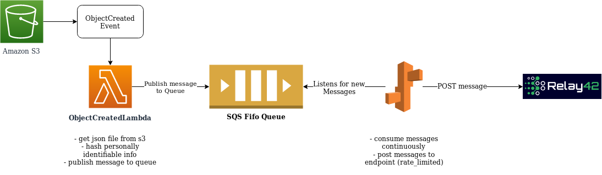

# R42 assignment
## Description of solution

See the Diagram for a clear image of the approach: 
Steps:
- upload *.json file to s3 bucket
- ObjectCreated event triggers lambda function
- lambda function validates data & hashes personable identifiable information and sends message to queue 
- queue-consumer listens to queue -> posts data to endpoint specified in the env variables

Points of improvement:

1. Deployment scripts automated on Cloudformation - also automated builds for dev/trial/prod
2. Tests.
3. Improved logging and statistics
4. SQS - I'm not 100% convinced on SQS and the consumer -I feel that something like RabbitMQ
5. Probably I should've looked at something like Celery
6. Load testing this approach (I'm curious to see where the limits are) 

*these are all points I considered out of scope, I realized during this project 

Solution diagram:

## Source code deployable to dev/test/prod
The architecture is pretty much the same - it would mean setting different env variables.

## Deployment steps
So in all honesty this is the part where I got stuck a little. 
The creation of resources and deployment itself is pretty straightforward but making sure all the 
IAM roles are set-up correctly and triggers are done correctly was the issue.

I guess that it would make sense to look at something like cloudformation.
But here goes:

### 1 - Install AWS-CLI dependencies

pip install awsebcli
pip install boto3

IAM-role for programmatic access should contain the `AWSElasticBeanstalkFullAccess` and `AmazonSQSFullAccess` policies.

### 2 & 3 - Create s3/sqs resources 
Run the deployment scripts: 
- create_s3_bucket.py
- create_sqs_queue.py

### 4 - Deploy lambda file-handler & set up `s3ObjectCreated` event

Deploy code in `./lambda-file-handler` folder to lambda
Set up S3 event to trigger lambda function whenever file is created.

IAM-role for lambda function should contain the `AmazonSQSFullAccess` policy.

### 5 - Set up sqs-consumer on elastic-beanstalk
cd into /eb-sqs-consumer directory

Issue the following commands:
- eb init consumer-sqs -p python-3.6 -r eu-central-1
- eb create sqs-consumer-app --single -i t2.nano

IAM role for service should contain the `AmazonSQSFullAccess` policy

endpoints for es-service:
GET - eb-beanstalk.url.com/status   -- displays the status of the sqs-consumer
GET - eb-beanstalk.url.com/start    -- start the consumer
GET - eb-beanstalk.url.com/stop     -- stop the consumer
